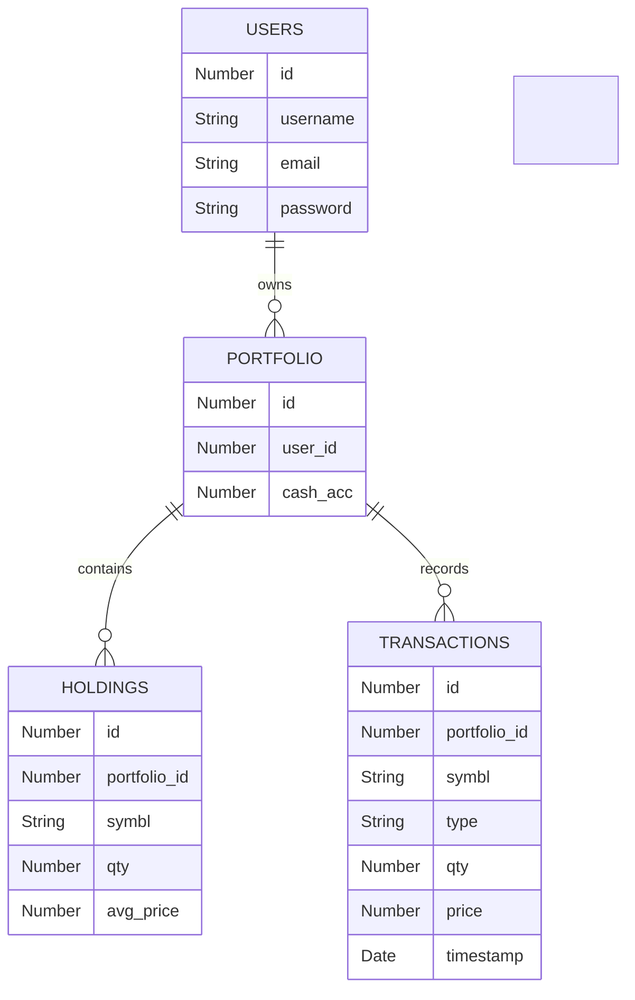

Logo

Basic generators
Git Connections
Generations
Spaces
Team
Trial active


Wizz677
Wizz677
Git Connections
2
Tools
Code documentation
Full Tree documentation
Codebase documentation
Readme generation
Release Notes generator
Versions
History
Version 1 (Definitive)
Version 2 (Latest)
Pro trial active
You're on a Pro trial! 6 days and 8 credits remaining

Choose your plan

Expand

Edit

Compare

Set as definitive

Download

Actions
Stock-1 Project Documentation
gradle/wrapper/gradle-wrapper.properties
This file configures the Gradle Wrapper distribution. It specifies where to download Gradle, how long to wait, and where to cache it locally.

distributionBase=GRADLE_USER_HOME
distributionPath=wrapper/dists
distributionUrl=https\://services.gradle.org/distributions/gradle-8.14.3-bin.zip
networkTimeout=10000
validateDistributionUrl=true
zipStoreBase=GRADLE_USER_HOME
zipStorePath=wrapper/dists
distributionBase and distributionPath define the root folder where Gradle stores wrapper distributions.
distributionUrl pins the exact Gradle version, ensuring build reproducibility across machines.
networkTimeout helps avoid hanging downloads on unstable connections.
zipStoreBase and zipStorePath control where the downloaded Gradle ZIP archive is cached locally.
gradlew
A POSIX-compliant shell script to bootstrap the Gradle Wrapper. It locates Java, sets up JVM options, and invokes the wrapper JAR.

#!/bin/sh
# Gradle wrapper script for POSIX (generated by Gradle)
# Licensed under the Apache License, Version 2.0

# Resolve APP_HOME and JAVA command...
# (script content omitted for brevity)

exec "$JAVACMD" "$@"
This script allows running ./gradlew without installing Gradle globally.
It detects JAVA_HOME or falls back to java on the PATH.
It configures JVM options like memory settings via environment variables.
Finally, it runs the Gradle Wrapper JAR that executes the configured tasks.
settings.gradle
Defines the root project’s name.

rootProject.name = 'Stock-1'
The project name appears in logs, IDEs, and generated artifacts.
It also influences the default name of the generated JAR file.
For multi-module builds, this file would also include subproject configuration.
build.gradle
Primary build configuration for the Spring Boot application. It sets up plugins, Java toolchain, repositories, and dependencies.

plugins {
    id 'java'
    id 'org.springframework.boot' version '3.5.7'
    id 'io.spring.dependency-management' version '1.1.7'
}
group = 'com.example'
version = '0.0.1-SNAPSHOT'
description = 'Demo project for Spring Boot'

java {
    toolchain { languageVersion = JavaLanguageVersion.of(17) }
}

repositories {
    mavenCentral()
}

dependencies {
    implementation 'org.springframework.boot:spring-boot-starter-web'
    implementation 'org.springframework.boot:spring-boot-starter-data-jdbc'
    implementation 'javax.annotation:javax.annotation-api:1.3.2'
    runtimeOnly     'org.postgresql:postgresql'
    developmentOnly 'org.springframework.boot:spring-boot-devtools'
    testImplementation 'org.springframework.boot:spring-boot-starter-test'
    testRuntimeOnly    'org.junit.platform:junit-platform-launcher'
}

tasks.named('test') {
    useJUnitPlatform()
}
The Spring Boot plugin adds tasks like bootRun and repackages the JAR with an embedded server.
spring-boot-starter-web pulls in Spring MVC and an embedded Tomcat by default.
spring-boot-starter-data-jdbc and postgresql enable database access through JdbcTemplate.
The Java toolchain enforces Java 17, avoiding mismatch between development environments.
src/main/resources/application.properties
Spring Boot configuration for application name and PostgreSQL datasource.

spring.application.name=Stock-1
spring.datasource.url=jdbc:postgresql://localhost:5432/stock
spring.datasource.username=postgres
spring.datasource.password=openaudit@123
spring.datasource.driver-class-name=org.postgresql.Driver
spring.application.name mainly appears in logs and can tag metrics.
The datasource properties tell Spring Boot how to connect and which driver to use.
With these properties, Boot auto-configures a DataSource and JdbcTemplate.
These settings directly support DataService, which uses the JdbcTemplate bean.
src/main/java/com/api/Stock1Application.java
Entry point for the Spring Boot application.

package com.api;

import org.springframework.boot.SpringApplication;
import org.springframework.boot.autoconfigure.SpringBootApplication;

@SpringBootApplication
public class Stock1Application {
    public static void main(String[] args) {
        SpringApplication.run(Stock1Application.class, args);
    }
}
@SpringBootApplication combines @Configuration, @EnableAutoConfiguration, and @ComponentScan.
Component scanning discovers controllers and services in the com.api package.
SpringApplication.run starts the embedded server and initializes the application context.
All controllers (HelloController, AuthController, StockController) become available once this main class runs.
src/main/java/com/api/Holding.java
Immutable record representing a portfolio holding.

package com.api;

public record Holding(
    long id,
    int portfolioId,
    String symbol,
    int quantity,
    double averagePrice
) {}
Java records automatically provide constructor, accessors, equals, and hashCode.
This record matches the logical concept of a stock position within a portfolio.
DataService uses holdingMapper to map SQL result rows into Holding instances.
StockController returns List<Holding> from /portfolio/holdings, exposing these objects as JSON.
src/main/java/com/api/Transaction.java
Immutable record for a buy/sell transaction.

package com.api;

import java.time.OffsetTime;

public record Transaction(
    long id,
    int portfolioId,
    String symbol,
    String type,    // "BUY" or "SELL"
    int quantity,
    double price,
    OffsetTime timestamp
) {}
This record captures a single event in the trading history.
type distinguishes between purchase and potential sale operations.
OffsetTime allows storage of time with offset, aligning with PostgreSQL TIMESTAMPTZ.
DataService uses transactionMapper so you can fetch transactions if needed in the future.
src/main/java/com/api/DataService.java
Service managing database schema and operations via JdbcTemplate.

package com.api;

import javax.annotation.PostConstruct;
import org.springframework.beans.factory.annotation.Autowired;
import org.springframework.dao.EmptyResultDataAccessException;
import org.springframework.jdbc.core.JdbcTemplate;
import org.springframework.jdbc.core.RowMapper;
import org.springframework.stereotype.Service;
import org.springframework.transaction.annotation.Transactional;
import java.time.OffsetTime;
import java.util.List;

@Service
public class DataService {
    @Autowired
    private JdbcTemplate jdbcTemplate;

    private final RowMapper<Holding> holdingMapper = (rs, rn) -> new Holding(
        rs.getLong("id"),
        rs.getInt("portfolio_id"),
        rs.getString("symbl"),
        rs.getInt("qty"),
        rs.getDouble("avg_price")
    );

    private final RowMapper<Transaction> transactionMapper = (rs, rn) -> new Transaction(
        rs.getLong("id"),
        rs.getInt("portfolio_id"),
        rs.getString("symbl"),
        rs.getString("type"),
        rs.getInt("qty"),
        rs.getDouble("price"),
        rs.getObject("timestamp", OffsetTime.class)
    );

    @PostConstruct
    public void initializeTables() {
        jdbcTemplate.execute("CREATE TABLE IF NOT EXISTS users("
            + "id SERIAL PRIMARY KEY,"
            + "username VARCHAR(50) NOT NULL,"
            + "email VARCHAR(100) NOT NULL,"
            + "password VARCHAR(100) NOT NULL)");

        jdbcTemplate.execute("CREATE TABLE IF NOT EXISTS portfolio("
            + "id SERIAL PRIMARY KEY,"
            + "user_id INTEGER NOT NULL,"
            + "cash_acc NUMERIC(12, 2) NOT NULL,"
            + "FOREIGN KEY (user_id) REFERENCES users(id))");

        jdbcTemplate.execute("CREATE TABLE IF NOT EXISTS holdings("
            + "id SERIAL PRIMARY KEY,"
            + "portfolio_id INTEGER NOT NULL,"
            + "symbl VARCHAR(20) NOT NULL,"
            + "qty INTEGER NOT NULL,"
            + "avg_price NUMERIC(12, 2) NOT NULL,"
            + "FOREIGN KEY (portfolio_id) REFERENCES portfolio(id),"
            + "UNIQUE(portfolio_id, symbl))");

        jdbcTemplate.execute("CREATE TABLE IF NOT EXISTS transactions("
            + "id SERIAL PRIMARY KEY,"
            + "portfolio_id INTEGER NOT NULL,"
            + "symbl VARCHAR(20) NOT NULL,"
            + "type VARCHAR(10) NOT NULL,"
            + "qty INTEGER NOT NULL,"
            + "price NUMERIC(12, 2) NOT NULL,"
            + "timestamp TIMESTAMPTZ NOT NULL DEFAULT CURRENT_TIMESTAMP,"
            + "FOREIGN KEY (portfolio_id) REFERENCES portfolio(id))");
    }

    public List<Holding> getHoldings(int portfolioId) {
        return jdbcTemplate.query(
            "SELECT * FROM holdings WHERE portfolio_id = ?",
            holdingMapper, portfolioId
        );
    }

    @Transactional
    public void buyStock(int portfolioId, String symbol, int quantity, double price) {
        List<Holding> existing = jdbcTemplate.query(
            "SELECT * FROM holdings WHERE portfolio_id = ? AND symbl = ?",
            holdingMapper, portfolioId, symbol
        );

        if (existing.isEmpty()) {
            jdbcTemplate.update(
                "INSERT INTO holdings(portfolio_id, symbl, qty, avg_price) VALUES (?, ?, ?, ?)",
                portfolioId, symbol, quantity, price
            );
        } else {
            Holding old = existing.get(0);
            int newQty = old.quantity() + quantity;
            double newAvg = ((old.averagePrice() * old.quantity()) + (price * quantity)) / newQty;
            jdbcTemplate.update(
                "UPDATE holdings SET qty = ?, avg_price = ? WHERE id = ?",
                newQty, newAvg, old.id()
            );
        }
        jdbcTemplate.update(
            "INSERT INTO transactions(portfolio_id, symbl, type, qty, price) VALUES (?, ?, 'BUY', ?, ?)",
            portfolioId, symbol, quantity, price
        );
    }
}
@Service marks this class as a Spring-managed bean, injected where needed.
@PostConstruct ensures tables exist before any business logic runs.
getHoldings is used by StockController to expose portfolio data through an API.
buyStock wraps read, insert, update, and log operations in a transaction, ensuring data consistency.
USERS
Number
id
String
username
String
email
String
password
PORTFOLIO
Number
id
Number
user_id
Number
cash_acc
HOLDINGS
Number
id
Number
portfolio_id
String
symbl
Number
qty
Number
avg_price
TRANSACTIONS
Number
id
Number
portfolio_id
String
symbl
String
type
Number
qty
Number
price
Date
timestamp
owns
contains
records
View
SVG
PNG
This diagram reflects the relationships created by initializeTables.
USERS can own multiple portfolios via the user_id foreign key.
Each portfolio can have many HOLDINGS and TRANSACTIONS.
src/main/java/com/api/FyersDataService.java
Service to fetch real-time and historical market data from Fyers API.

package com.api;

import org.springframework.stereotype.Service;
import org.springframework.web.client.RestTemplate;
import org.springframework.web.util.UriComponentsBuilder;
import org.springframework.http.*;

@Service
public class FyersDataService {
    private final String FYERS_DATA_URL = "https://api-t1.fyers.in";
    private RestTemplate restTemplate = new RestTemplate();

    public String getQuotes(String symbols) {
        if (AuthController.ACCESS_TOKEN == null) {
            throw new RuntimeException("Not authenticated. Call /auth/login first.");
        }
        String url = FYERS_DATA_URL + "/data/v3/quotes?symbols=" + symbols;
        return createAndSendRequest(url);
    }

    public String getHistory(String symbol, String resolution, String from, String to) {
        if (AuthController.ACCESS_TOKEN == null) {
            throw new RuntimeException("Not authenticated. Call /auth/login first.");
        }
        String url = UriComponentsBuilder
            .fromHttpUrl(FYERS_DATA_URL + "/data/history")
            .queryParam("symbol", symbol)
            .queryParam("resolution", resolution)
            .queryParam("date_format", "1")
            .queryParam("range_from", from)
            .queryParam("range_to", to)
            .queryParam("cont_flag", "1")
            .toUriString();
        return createAndSendRequest(url);
    }

    private String createAndSendRequest(String url) {
        HttpHeaders headers = new HttpHeaders();
        headers.set("Authorization", AuthController.FYERS_APP_ID + ":" + AuthController.ACCESS_TOKEN);
        HttpEntity<String> entity = new HttpEntity<>(headers);
        ResponseEntity<String> resp = restTemplate.exchange(url, HttpMethod.GET, entity, String.class);
        return resp.getBody();
    }
}
This service centralizes Fyers HTTP calls, avoiding duplication in controllers.
It reads AuthController.ACCESS_TOKEN, so authentication must occur first.
getQuotes and getHistory both rely on the same createAndSendRequest helper.
StockController uses getHistory, while it implements a separate quote method.
FyersAPI
FyersDataService
StockController
Client
FyersAPI
FyersDataService
StockController
Client
GET /fyers/history?symbol=XYZ
getHistory(symbol, ...)
GET data/history with Authorization header
JSON candles
Raw JSON string
JSON response
View
SVG
PNG
This sequence shows how StockController delegates work to FyersDataService.
The access token from AuthController is embedded in the Authorization header.
src/main/java/com/api/HelloController.java
Basic REST controller with two endpoints for greetings.

package com.api;

import org.springframework.web.bind.annotation.GetMapping;
import org.springframework.web.bind.annotation.RestController;

@RestController
public class HelloController {
    @GetMapping("/hello")
    public String sayHello() {
        return "Hello from my first REST API!";
    }

    @GetMapping("/goodbye")
    public String sayGoodbye() {
        return "Goodbye for now!";
    }
}
This controller is useful for sanity checks or health-style endpoints.
It demonstrates the simplest possible @RestController mappings.
No services or external dependencies are involved here.
GET /hello
Hello Endpoint
Export to Postman
Returns a greeting message

GET
http://localhost:8080/hello
Code examples
curl -X GET "http://localhost:8080/hello"
Responses
Greeting message

Hello from my first REST API!
This endpoint is stateless and returns a constant string.
You can quickly test if the application is running using this route.
GET /goodbye
Goodbye Endpoint
Export to Postman
Returns a farewell message

GET
http://localhost:8080/goodbye
Code examples
curl -X GET "http://localhost:8080/goodbye"
Responses
Farewell message

Goodbye for now!
Similar to /hello, this endpoint confirms connectivity and routing.
It can also serve as a template for adding more simple endpoints.
src/main/java/com/api/AuthController.java
Handles OAuth2 v3 flow with Fyers: login redirection and callback token exchange.

package com.api;

import org.springframework.web.bind.annotation.*;
import jakarta.servlet.http.HttpServletResponse;
import org.springframework.http.*;
import org.springframework.web.client.RestTemplate;
import com.fasterxml.jackson.databind.JsonNode;
import java.security.MessageDigest;
import java.nio.charset.StandardCharsets;
import java.util.Formatter;

@RestController
public class AuthController {
    public static final String FYERS_APP_ID = "HNZM6GB724-100";
    private final String FYERS_SECRET_ID = "THZ99396N9";
    private final String FYERS_REDIRECT_URL = "http://127.0.0.1:8080/auth/callback";
    public static String ACCESS_TOKEN = null;

    @GetMapping("/auth/login")
    public void fyersLogin(HttpServletResponse response) throws java.io.IOException {
        String url = "https://api-t1.fyers.in/api/v3/generate-authcode?client_id="
            + FYERS_APP_ID + "&redirect_uri=" + FYERS_REDIRECT_URL
            + "&response_type=code&state=your_custom_state";
        response.sendRedirect(url);
    }

    @GetMapping("/auth/callback")
    public String getAccessToken(@RequestParam("auth_code") String authCode) {
        RestTemplate rt = new RestTemplate();
        String tokenUrl = "https://api-t1.fyers.in/api/v3/validate-authcode";
        String hash = sha256(FYERS_APP_ID + ":" + FYERS_SECRET_ID);
        String body = "{\"grant_type\":\"authorization_code\",\"code\":\""
            + authCode + "\",\"appIdHash\":\"" + hash + "\"}";
        HttpHeaders h = new HttpHeaders();
        h.setContentType(MediaType.APPLICATION_JSON);
        ResponseEntity<JsonNode> resp = rt.postForEntity(tokenUrl, new HttpEntity<>(body,h), JsonNode.class);
        if (resp.getStatusCode()==HttpStatus.OK) {
            ACCESS_TOKEN = resp.getBody().get("access_token").asText();
            return "SUCCESS! V3 Access Token received: " + ACCESS_TOKEN;
        }
        return "Error: Fyers API returned status " + resp.getStatusCode();
    }

    private String sha256(String input) {
        try {
            MessageDigest d = MessageDigest.getInstance("SHA-256");
            byte[] hash = d.digest(input.getBytes(StandardCharsets.UTF_8));
            Formatter f = new Formatter();
            for (byte b : hash) f.format("%02x", b);
            String hex = f.toString();
            f.close();
            return hex;
        } catch (Exception e) {
            throw new RuntimeException("Hashing failed", e);
        }
    }
}
FYERS_APP_ID and FYERS_SECRET_ID identify your application to Fyers.
/auth/login starts the OAuth flow by redirecting to the broker.
/auth/callback receives auth_code, exchanges it for ACCESS_TOKEN, and stores it statically.
Other components like FyersDataService and StockController rely on ACCESS_TOKEN being set.
FyersAPI
AuthController
Browser
User
FyersAPI
AuthController
Browser
User
Open /auth/login
GET /auth/login
Redirect to Fyers login
Login and authorize
Redirect to /auth/callback with auth_code
GET /auth/callback?auth_code=...
POST validate-authcode
access_token
SUCCESS message
View
SVG
PNG
This diagram shows the full OAuth code exchange flow with Fyers.
Once completed, the static ACCESS_TOKEN value unlocks all Fyers data endpoints.
GET /auth/login
Fyers Login Redirect
Export to Postman
Redirects user to Fyers authentication page

GET
http://localhost:8080/auth/login
Code examples
curl -X GET "http://localhost:8080/auth/login"
Responses
Redirect to Fyers login URL

The client never receives a JSON body from this endpoint.
The important effect is the HTTP 302 redirect to Fyers.
GET /auth/callback
Fyers Callback
Export to Postman
Handles Fyers auth callback and retrieves access token

GET
http://localhost:8080/auth/callback
Query parameters
auth_code
string
required
Authorization code from Fyers

Code examples
curl -X GET "http://localhost:8080/auth/callback?auth_code=Authorization+code+from+Fyers"
Responses
200
400
Access token retrieval success

SUCCESS! V3 Access Token received: <token>
Error during token validation

{
  "error": "Error message"
}
This endpoint both validates the auth code and saves the token in memory.
In a production setup, you would store the token securely and refresh it when needed.
src/main/java/com/api/StockController.java
Main API controller tying services together for market data and portfolio management.

package com.api;

import java.util.List;
import org.springframework.beans.factory.annotation.Autowired;
import org.springframework.web.bind.annotation.*;
import org.springframework.http.*;

@RestController
public class StockController {
    @Autowired
    private FyersDataService fyersService;

    @Autowired
    private DataService databaseService;

    @GetMapping("/fyers/quote")
    public String getFyersQuote(@RequestParam("symbol") String symbol) { … }

    @GetMapping("/fyers/history")
    public String getStockHistory(@RequestParam("symbol") String symbol) { … }

    @GetMapping("/portfolio/holdings")
    public List<Holding> getMyHoldings() { … }

    @PostMapping("/portfolio/buy")
    public String buyDummyStock(@RequestParam String symbol, @RequestParam int quantity) { … }
}
StockController is the main integration point between Fyers and your own database.
It uses constructor or field-based dependency injection via @Autowired.
Endpoints here offer market data and basic trading-like operations to clients.
GET /fyers/quote
Get Fyers Quote
Export to Postman
Fetches real-time quote for a given symbol from Fyers

GET
http://localhost:8080/fyers/quote
Headers
Authorization
string • header
required
HNZM6GB724-100:<access_token>

Query parameters
symbol
string
required
Trading symbol

Code examples
curl -X GET "http://localhost:8080/fyers/quote?symbol=Trading+symbol" \
  -H "Authorization: HNZM6GB724-100:<access_token>"
Responses
200
400
Raw JSON quote data

{
  "symbol": "NSE:SBIN-EQ",
  "ltp": 456.78
}
Not authenticated or error occurred

"Error: Not authenticated. Please go to /auth/login first."
This endpoint directly calls the Fyers quote URL instead of FyersDataService.
It sets the Authorization header using FYERS_APP_ID and ACCESS_TOKEN.
If ACCESS_TOKEN is missing, it returns a human-readable error string.
GET /fyers/history
Get Fyers History
Export to Postman
Fetches historical data for a given symbol from Fyers

GET
http://localhost:8080/fyers/history
Headers
Authorization
string • header
required
HNZM6GB724-100:<access_token>

Query parameters
symbol
string
required
Trading symbol

Code examples
curl -X GET "http://localhost:8080/fyers/history?symbol=Trading+symbol" \
  -H "Authorization: HNZM6GB724-100:<access_token>"
Responses
200
400
Raw JSON historical data

[{"t":"2024-01-01","o":100.0,"h":110.0,"l":90.0,"c":105.0,"v":10000}]
Error occurred

"Error: <message>"
This endpoint delegates the entire Fyers call to FyersDataService.
It currently uses fixed dates and resolution, but accepts the symbol parameter.
Any exception in FyersDataService is caught and returned as a string message.
GET /portfolio/holdings
Get Portfolio Holdings
Export to Postman
Retrieves current holdings for portfolio ID 1

GET
http://localhost:8080/portfolio/holdings
Code examples
curl -X GET "http://localhost:8080/portfolio/holdings"
Responses
List of holdings

[
  {
    "id": 1,
    "portfolioId": 1,
    "symbol": "SBIN",
    "quantity": 10,
    "averagePrice": 350.0
  }
]
This endpoint uses a hardcoded portfolioId of 1 for simplicity.
It serializes Holding records to JSON using Spring Boot’s default converter.
In a multi-user setup, you would likely derive portfolio ID from the authenticated user.
POST /portfolio/buy
Buy Stock
Export to Postman
Performs a dummy purchase and logs transaction

POST
http://localhost:8080/portfolio/buy
Query parameters
symbol
string
required
Trading symbol

quantity
string
required
Number of shares to buy

Code examples
curl -X POST "http://localhost:8080/portfolio/buy?symbol=Trading+symbol&quantity=Number+of+shares+to+buy"
Responses
200
400
Successful purchase message

"Successfully bought 5 of SBIN"
Error during purchase

"Error buying stock: <message>"
This endpoint simulates a buy order using a fixed dummy price.
It then calls DataService.buyStock, which updates holdings and logs a transaction.
You could later replace the dummy price with the real quote from Fyers.
Database
DataService
StockController
Client
Database
DataService
StockController
Client
alt
[no existing holding]
[existing holding]
POST /portfolio/buy
buyStock(1, symbol, qty, price)
SELECT existing holding
INSERT new holding
UPDATE holding
INSERT transaction log
void
Success message
View
SVG
PNG
This sequence illustrates the transactional flow behind the /portfolio/buy endpoint.
The @Transactional annotation ensures either all DB operations succeed or none do.
src/test/java/com/api/Stock1ApplicationTests.java
Basic Spring Boot test to verify context loads.

package com.api;

import org.junit.jupiter.api.Test;
import org.springframework.boot.test.context.SpringBootTest;

@SpringBootTest
class Stock1ApplicationTests {
    @Test
    void contextLoads() {
    }
}
@SpringBootTest starts the full application context in a test environment.
contextLoads verifies that no startup errors occur with current configuration.
This acts as a safety net when you change beans or configuration.
Architecture Overview
This class diagram shows core components and their relationships.

uses
uses
maps to
maps to
reads ACCESS_TOKEN
Stock1Application
HelloController
AuthController
StockController
FyersDataService
DataService
Holding
Transaction
View
SVG
PNG
Stock1Application bootstraps the entire system.
Controllers expose REST APIs and delegate work to services.
DataService encapsulates persistence logic, while FyersDataService encapsulates external API communication.
Records Holding and Transaction serve as simple, immutable data carriers in this architecture.
Detailed
Enter instructions to modify the document... (Will create a new version)

Modify
This action will create a new version of the document.

​ 

Recommendation
We recommend adding this document to a Space and editing from there for better organization and collaboration features.

You can add it on the "Add to Space" button in the Actions dropdown.

Content
# Stock-1 Project Documentation
​
## gradle/wrapper/gradle-wrapper.properties  
This file configures the Gradle Wrapper distribution. It specifies where to download Gradle, how long to wait, and where to cache it locally.
​
```properties
distributionBase=GRADLE_USER_HOME
distributionPath=wrapper/dists
distributionUrl=https\://services.gradle.org/distributions/gradle-8.14.3-bin.zip
networkTimeout=10000
validateDistributionUrl=true
zipStoreBase=GRADLE_USER_HOME
zipStorePath=wrapper/dists
```
​
- `distributionBase` and `distributionPath` define the root folder where Gradle stores wrapper distributions.  
- `distributionUrl` pins the exact Gradle version, ensuring build reproducibility across machines.  
- `networkTimeout` helps avoid hanging downloads on unstable connections.  
- `zipStoreBase` and `zipStorePath` control where the downloaded Gradle ZIP archive is cached locally.
​
## gradlew  
A POSIX-compliant shell script to bootstrap the Gradle Wrapper. It locates Java, sets up JVM options, and invokes the wrapper JAR.
​
```bash
#!/bin/sh
# Gradle wrapper script for POSIX (generated by Gradle)
# Licensed under the Apache License, Version 2.0
​
# Resolve APP_HOME and JAVA command...
# (script content omitted for brevity)
​
exec "$JAVACMD" "$@"
```
​
- This script allows running `./gradlew` without installing Gradle globally.  
- It detects `JAVA_HOME` or falls back to `java` on the `PATH`.  
- It configures JVM options like memory settings via environment variables.  
- Finally, it runs the Gradle Wrapper JAR that executes the configured tasks.
​
## settings.gradle  
Defines the root project’s name.
​
```groovy
rootProject.name = 'Stock-1'
```
​
- The project name appears in logs, IDEs, and generated artifacts.  
- It also influences the default name of the generated JAR file.  
- For multi-module builds, this file would also include subproject configuration.  
​
## build.gradle  
Primary build configuration for the Spring Boot application. It sets up plugins, Java toolchain, repositories, and dependencies.
​
```groovy
plugins {
    id 'java'
    id 'org.springframework.boot' version '3.5.7'
    id 'io.spring.dependency-management' version '1.1.7'
}
group = 'com.example'
version = '0.0.1-SNAPSHOT'
description = 'Demo project for Spring Boot'
​
java {
    toolchain { languageVersion = JavaLanguageVersion.of(17) }
}
​
repositories {
    mavenCentral()
}
​
dependencies {
    implementation 'org.springframework.boot:spring-boot-starter-web'
    implementation 'org.springframework.boot:spring-boot-starter-data-jdbc'
    implementation 'javax.annotation:javax.annotation-api:1.3.2'
    runtimeOnly     'org.postgresql:postgresql'
    developmentOnly 'org.springframework.boot:spring-boot-devtools'
    testImplementation 'org.springframework.boot:spring-boot-starter-test'
    testRuntimeOnly    'org.junit.platform:junit-platform-launcher'
}
​
tasks.named('test') {
    useJUnitPlatform()
}
```
​
- The Spring Boot plugin adds tasks like `bootRun` and repackages the JAR with an embedded server.  
- `spring-boot-starter-web` pulls in Spring MVC and an embedded Tomcat by default.  
- `spring-boot-starter-data-jdbc` and `postgresql` enable database access through `JdbcTemplate`.  
- The Java toolchain enforces Java 17, avoiding mismatch between development environments.  
​
## src/main/resources/application.properties  
Spring Boot configuration for application name and PostgreSQL datasource.
​
```properties
spring.application.name=Stock-1
spring.datasource.url=jdbc:postgresql://localhost:5432/stock
spring.datasource.username=postgres
spring.datasource.password=openaudit@123
spring.datasource.driver-class-name=org.postgresql.Driver
```
​
- `spring.application.name` mainly appears in logs and can tag metrics.  
- The datasource properties tell Spring Boot how to connect and which driver to use.  
- With these properties, Boot auto-configures a `DataSource` and `JdbcTemplate`.  
- These settings directly support `DataService`, which uses the `JdbcTemplate` bean.
​
## src/main/java/com/api/Stock1Application.java  
Entry point for the Spring Boot application.
​
```java
package com.api;
​
import org.springframework.boot.SpringApplication;
import org.springframework.boot.autoconfigure.SpringBootApplication;
​
@SpringBootApplication
public class Stock1Application {
    public static void main(String[] args) {
        SpringApplication.run(Stock1Application.class, args);
    }
}
```
​
- `@SpringBootApplication` combines `@Configuration`, `@EnableAutoConfiguration`, and `@ComponentScan`.  
- Component scanning discovers controllers and services in the `com.api` package.  
- `SpringApplication.run` starts the embedded server and initializes the application context.  
- All controllers (`HelloController`, `AuthController`, `StockController`) become available once this main class runs.
​
## src/main/java/com/api/Holding.java  
Immutable record representing a portfolio holding.
​
```java
package com.api;
​
public record Holding(
    long id,
    int portfolioId,
    String symbol,
    int quantity,
    double averagePrice
) {}
```
​
- Java records automatically provide constructor, accessors, `equals`, and `hashCode`.  
- This record matches the logical concept of a stock position within a portfolio.  
- `DataService` uses `holdingMapper` to map SQL result rows into `Holding` instances.  
- `StockController` returns `List<Holding>` from `/portfolio/holdings`, exposing these objects as JSON.
​
## src/main/java/com/api/Transaction.java  
Immutable record for a buy/sell transaction.
​
```java
package com.api;
​
import java.time.OffsetTime;
​
public record Transaction(
    long id,
    int portfolioId,
    String symbol,
    String type,    // "BUY" or "SELL"
    int quantity,
    double price,
    OffsetTime timestamp
) {}
```
​
- This record captures a single event in the trading history.  
- `type` distinguishes between purchase and potential sale operations.  
- `OffsetTime` allows storage of time with offset, aligning with PostgreSQL `TIMESTAMPTZ`.  
- `DataService` uses `transactionMapper` so you can fetch transactions if needed in the future.
​
## src/main/java/com/api/DataService.java  
Service managing database schema and operations via `JdbcTemplate`.
​
```java
package com.api;
​
import javax.annotation.PostConstruct;
import org.springframework.beans.factory.annotation.Autowired;
import org.springframework.dao.EmptyResultDataAccessException;
import org.springframework.jdbc.core.JdbcTemplate;
import org.springframework.jdbc.core.RowMapper;
import org.springframework.stereotype.Service;
import org.springframework.transaction.annotation.Transactional;
import java.time.OffsetTime;
import java.util.List;
​
@Service
public class DataService {
    @Autowired
    private JdbcTemplate jdbcTemplate;
​
    private final RowMapper<Holding> holdingMapper = (rs, rn) -> new Holding(
        rs.getLong("id"),
        rs.getInt("portfolio_id"),
        rs.getString("symbl"),
        rs.getInt("qty"),
        rs.getDouble("avg_price")
    );
​
    private final RowMapper<Transaction> transactionMapper = (rs, rn) -> new Transaction(
        rs.getLong("id"),
        rs.getInt("portfolio_id"),
        rs.getString("symbl"),
        rs.getString("type"),
        rs.getInt("qty"),
        rs.getDouble("price"),
        rs.getObject("timestamp", OffsetTime.class)
    );
​
    @PostConstruct
    public void initializeTables() {
        jdbcTemplate.execute("CREATE TABLE IF NOT EXISTS users("
            + "id SERIAL PRIMARY KEY,"
            + "username VARCHAR(50) NOT NULL,"
            + "email VARCHAR(100) NOT NULL,"
            + "password VARCHAR(100) NOT NULL)");
​
        jdbcTemplate.execute("CREATE TABLE IF NOT EXISTS portfolio("
            + "id SERIAL PRIMARY KEY,"
            + "user_id INTEGER NOT NULL,"
            + "cash_acc NUMERIC(12, 2) NOT NULL,"
            + "FOREIGN KEY (user_id) REFERENCES users(id))");
​
        jdbcTemplate.execute("CREATE TABLE IF NOT EXISTS holdings("
            + "id SERIAL PRIMARY KEY,"
            + "portfolio_id INTEGER NOT NULL,"
            + "symbl VARCHAR(20) NOT NULL,"
            + "qty INTEGER NOT NULL,"
            + "avg_price NUMERIC(12, 2) NOT NULL,"
            + "FOREIGN KEY (portfolio_id) REFERENCES portfolio(id),"
            + "UNIQUE(portfolio_id, symbl))");
​
        jdbcTemplate.execute("CREATE TABLE IF NOT EXISTS transactions("
            + "id SERIAL PRIMARY KEY,"
            + "portfolio_id INTEGER NOT NULL,"
            + "symbl VARCHAR(20) NOT NULL,"
            + "type VARCHAR(10) NOT NULL,"
            + "qty INTEGER NOT NULL,"
            + "price NUMERIC(12, 2) NOT NULL,"
            + "timestamp TIMESTAMPTZ NOT NULL DEFAULT CURRENT_TIMESTAMP,"
            + "FOREIGN KEY (portfolio_id) REFERENCES portfolio(id))");
    }
​
    public List<Holding> getHoldings(int portfolioId) {
        return jdbcTemplate.query(
            "SELECT * FROM holdings WHERE portfolio_id = ?",
            holdingMapper, portfolioId
        );
    }
​
    @Transactional
    public void buyStock(int portfolioId, String symbol, int quantity, double price) {
        List<Holding> existing = jdbcTemplate.query(
            "SELECT * FROM holdings WHERE portfolio_id = ? AND symbl = ?",
            holdingMapper, portfolioId, symbol
        );
​
        if (existing.isEmpty()) {
            jdbcTemplate.update(
                "INSERT INTO holdings(portfolio_id, symbl, qty, avg_price) VALUES (?, ?, ?, ?)",
                portfolioId, symbol, quantity, price
            );
        } else {
            Holding old = existing.get(0);
            int newQty = old.quantity() + quantity;
            double newAvg = ((old.averagePrice() * old.quantity()) + (price * quantity)) / newQty;
            jdbcTemplate.update(
                "UPDATE holdings SET qty = ?, avg_price = ? WHERE id = ?",
                newQty, newAvg, old.id()
            );
        }
        jdbcTemplate.update(
            "INSERT INTO transactions(portfolio_id, symbl, type, qty, price) VALUES (?, ?, 'BUY', ?, ?)",
            portfolioId, symbol, quantity, price
        );
    }
}
```
​
- `@Service` marks this class as a Spring-managed bean, injected where needed.  
- `@PostConstruct` ensures tables exist before any business logic runs.  
- `getHoldings` is used by `StockController` to expose portfolio data through an API.  
- `buyStock` wraps read, insert, update, and log operations in a transaction, ensuring data consistency.
​

​
- This diagram reflects the relationships created by `initializeTables`.  
- `USERS` can own multiple portfolios via the `user_id` foreign key.  
- Each portfolio can have many `HOLDINGS` and `TRANSACTIONS`.  
​
## src/main/java/com/api/FyersDataService.java  
Service to fetch real-time and historical market data from Fyers API.
​
```java
package com.api;
​
import org.springframework.stereotype.Service;
import org.springframework.web.client.RestTemplate;
import org.springframework.web.util.UriComponentsBuilder;
import org.springframework.http.*;
​
@Service
public class FyersDataService {
    private final String FYERS_DATA_URL = "https://api-t1.fyers.in";
    private RestTemplate restTemplate = new RestTemplate();
​
    public String getQuotes(String symbols) {
        if (AuthController.ACCESS_TOKEN == null) {
            throw new RuntimeException("Not authenticated. Call /auth/login first.");
        }
        String url = FYERS_DATA_URL + "/data/v3/quotes?symbols=" + symbols;
        return createAndSendRequest(url);
    }
​
    public String getHistory(String symbol, String resolution, String from, String to) {
        if (AuthController.ACCESS_TOKEN == null) {
            throw new RuntimeException("Not authenticated. Call /auth/login first.");
        }
        String url = UriComponentsBuilder
            .fromHttpUrl(FYERS_DATA_URL + "/data/history")
            .queryParam("symbol", symbol)
            .queryParam("resolution", resolution)
            .queryParam("date_format", "1")
            .queryParam("range_from", from)
            .queryParam("range_to", to)
            .queryParam("cont_flag", "1")
            .toUriString();
        return createAndSendRequest(url);
    }
​
    private String createAndSendRequest(String url) {
        HttpHeaders headers = new HttpHeaders();
        headers.set("Authorization", AuthController.FYERS_APP_ID + ":" + AuthController.ACCESS_TOKEN);
        HttpEntity<String> entity = new HttpEntity<>(headers);
        ResponseEntity<String> resp = restTemplate.exchange(url, HttpMethod.GET, entity, String.class);
        return resp.getBody();
    }
}
```
​
- This service centralizes Fyers HTTP calls, avoiding duplication in controllers.  
- It reads `AuthController.ACCESS_TOKEN`, so authentication must occur first.  
- `getQuotes` and `getHistory` both rely on the same `createAndSendRequest` helper.  
- `StockController` uses `getHistory`, while it implements a separate quote method.
​
```mermaid
sequenceDiagram
    participant Client
    participant StockController
    participant FyersDataService
    participant FyersAPI
​
    Client->>StockController: GET /fyers/history?symbol=XYZ
    StockController->>FyersDataService: getHistory(symbol, ...)
    FyersDataService->>FyersAPI: GET data/history with Authorization header
    FyersAPI-->>FyersDataService: JSON candles
    FyersDataService-->>StockController: Raw JSON string
    StockController-->>Client: JSON response
```
​
- This sequence shows how `StockController` delegates work to `FyersDataService`.  
- The access token from `AuthController` is embedded in the Authorization header.  
​
## src/main/java/com/api/HelloController.java  
Basic REST controller with two endpoints for greetings.
​
```java
package com.api;
​
import org.springframework.web.bind.annotation.GetMapping;
import org.springframework.web.bind.annotation.RestController;
​
@RestController
public class HelloController {
    @GetMapping("/hello")
    public String sayHello() {
        return "Hello from my first REST API!";
    }
​
    @GetMapping("/goodbye")
    public String sayGoodbye() {
        return "Goodbye for now!";
    }
}
```
​
- This controller is useful for sanity checks or health-style endpoints.  
- It demonstrates the simplest possible `@RestController` mappings.  
- No services or external dependencies are involved here.  
​
### GET /hello  
```api
{
    "title": "Hello Endpoint",
    "description": "Returns a greeting message",
    "method": "GET",
    "baseUrl": "http://localhost:8080",
    "endpoint": "/hello",
    "headers": [],
    "queryParams": [],
    "pathParams": [],
    "bodyType": "none",
    "requestBody": "",
    "formData": [],
    "responses": {
        "200": {
            "description": "Greeting message",
            "body": "Hello from my first REST API!"
        }
    }
}
```
​
- This endpoint is stateless and returns a constant string.  
- You can quickly test if the application is running using this route.  
​
### GET /goodbye  
```api
{
    "title": "Goodbye Endpoint",
    "description": "Returns a farewell message",
    "method": "GET",
    "baseUrl": "http://localhost:8080",
    "endpoint": "/goodbye",
    "headers": [],
    "queryParams": [],
    "pathParams": [],
    "bodyType": "none",
    "requestBody": "",
    "formData": [],
    "responses": {
        "200": {
            "description": "Farewell message",
            "body": "Goodbye for now!"
        }
    }
}
```
​
- Similar to `/hello`, this endpoint confirms connectivity and routing.  
- It can also serve as a template for adding more simple endpoints.  
​
## src/main/java/com/api/AuthController.java  
Handles OAuth2 v3 flow with Fyers: login redirection and callback token exchange.
​
```java
package com.api;
​
import org.springframework.web.bind.annotation.*;
import jakarta.servlet.http.HttpServletResponse;
import org.springframework.http.*;
import org.springframework.web.client.RestTemplate;
import com.fasterxml.jackson.databind.JsonNode;
import java.security.MessageDigest;
import java.nio.charset.StandardCharsets;
import java.util.Formatter;
​
@RestController
public class AuthController {
    public static final String FYERS_APP_ID = "HNZM6GB724-100";
    private final String FYERS_SECRET_ID = "THZ99396N9";
    private final String FYERS_REDIRECT_URL = "http://127.0.0.1:8080/auth/callback";
    public static String ACCESS_TOKEN = null;
​
    @GetMapping("/auth/login")
    public void fyersLogin(HttpServletResponse response) throws java.io.IOException {
        String url = "https://api-t1.fyers.in/api/v3/generate-authcode?client_id="
            + FYERS_APP_ID + "&redirect_uri=" + FYERS_REDIRECT_URL
            + "&response_type=code&state=your_custom_state";
        response.sendRedirect(url);
    }
​
    @GetMapping("/auth/callback")
    public String getAccessToken(@RequestParam("auth_code") String authCode) {
        RestTemplate rt = new RestTemplate();
        String tokenUrl = "https://api-t1.fyers.in/api/v3/validate-authcode";
        String hash = sha256(FYERS_APP_ID + ":" + FYERS_SECRET_ID);
        String body = "{\"grant_type\":\"authorization_code\",\"code\":\""
            + authCode + "\",\"appIdHash\":\"" + hash + "\"}";
        HttpHeaders h = new HttpHeaders();
        h.setContentType(MediaType.APPLICATION_JSON);
        ResponseEntity<JsonNode> resp = rt.postForEntity(tokenUrl, new HttpEntity<>(body,h), JsonNode.class);
        if (resp.getStatusCode()==HttpStatus.OK) {
            ACCESS_TOKEN = resp.getBody().get("access_token").asText();
            return "SUCCESS! V3 Access Token received: " + ACCESS_TOKEN;
        }
        return "Error: Fyers API returned status " + resp.getStatusCode();
    }
​
    private String sha256(String input) {
        try {
            MessageDigest d = MessageDigest.getInstance("SHA-256");
            byte[] hash = d.digest(input.getBytes(StandardCharsets.UTF_8));
            Formatter f = new Formatter();
            for (byte b : hash) f.format("%02x", b);
            String hex = f.toString();
            f.close();
            return hex;
        } catch (Exception e) {
            throw new RuntimeException("Hashing failed", e);
        }
    }
}
```
​
- `FYERS_APP_ID` and `FYERS_SECRET_ID` identify your application to Fyers.  
- `/auth/login` starts the OAuth flow by redirecting to the broker.  
- `/auth/callback` receives `auth_code`, exchanges it for `ACCESS_TOKEN`, and stores it statically.  
- Other components like `FyersDataService` and `StockController` rely on `ACCESS_TOKEN` being set.
​
```mermaid
sequenceDiagram
    participant User
    participant Browser
    participant AuthController
    participant FyersAPI
​
    User->>Browser: Open /auth/login
    Browser->>AuthController: GET /auth/login
    AuthController-->>Browser: Redirect to Fyers login
    Browser->>FyersAPI: Login and authorize
    FyersAPI-->>Browser: Redirect to /auth/callback with auth_code
    Browser->>AuthController: GET /auth/callback?auth_code=...
    AuthController->>FyersAPI: POST validate-authcode
    FyersAPI-->>AuthController: access_token
    AuthController-->>Browser: SUCCESS message
```
​
- This diagram shows the full OAuth code exchange flow with Fyers.  
- Once completed, the static `ACCESS_TOKEN` value unlocks all Fyers data endpoints.  
​
### GET /auth/login  
```api
{
    "title": "Fyers Login Redirect",
    "description": "Redirects user to Fyers authentication page",
    "method": "GET",
    "baseUrl": "http://localhost:8080",
    "endpoint": "/auth/login",
    "headers": [],
    "queryParams": [],
    "pathParams": [],
    "bodyType": "none",
    "requestBody": "",
    "formData": [],
    "responses": {
        "302": {
            "description": "Redirect to Fyers login URL",
            "body": ""
        }
    }
}
```
​
- The client never receives a JSON body from this endpoint.  
- The important effect is the HTTP `302` redirect to Fyers.  
​
### GET /auth/callback  
```api
{
    "title": "Fyers Callback",
    "description": "Handles Fyers auth callback and retrieves access token",
    "method": "GET",
    "baseUrl": "http://localhost:8080",
    "endpoint": "/auth/callback",
    "headers": [],
    "queryParams": [
        {
            "key": "auth_code",
            "value": "Authorization code from Fyers",
            "required": true
        }
    ],
    "pathParams": [],
    "bodyType": "none",
    "requestBody": "",
    "formData": [],
    "responses": {
        "200": {
            "description": "Access token retrieval success",
            "body": "SUCCESS! V3 Access Token received: <token>"
        },
        "400": {
            "description": "Error during token validation",
            "body": "{\n  \"error\": \"Error message\"\n}"
        }
    }
}
```
​
- This endpoint both validates the auth code and saves the token in memory.  
- In a production setup, you would store the token securely and refresh it when needed.  
​
## src/main/java/com/api/StockController.java  
Main API controller tying services together for market data and portfolio management.
​
```java
package com.api;
​
import java.util.List;
import org.springframework.beans.factory.annotation.Autowired;
import org.springframework.web.bind.annotation.*;
import org.springframework.http.*;
​
@RestController
public class StockController {
    @Autowired
    private FyersDataService fyersService;
​
    @Autowired
    private DataService databaseService;
​
    @GetMapping("/fyers/quote")
    public String getFyersQuote(@RequestParam("symbol") String symbol) { … }
​
    @GetMapping("/fyers/history")
    public String getStockHistory(@RequestParam("symbol") String symbol) { … }
​
    @GetMapping("/portfolio/holdings")
    public List<Holding> getMyHoldings() { … }
​
    @PostMapping("/portfolio/buy")
    public String buyDummyStock(@RequestParam String symbol, @RequestParam int quantity) { … }
}
```
​
- `StockController` is the main integration point between Fyers and your own database.  
- It uses constructor or field-based dependency injection via `@Autowired`.  
- Endpoints here offer market data and basic trading-like operations to clients.  
​
### GET /fyers/quote  
```api
{
    "title": "Get Fyers Quote",
    "description": "Fetches real-time quote for a given symbol from Fyers",
    "method": "GET",
    "baseUrl": "http://localhost:8080",
    "endpoint": "/fyers/quote",
    "headers": [
        {
            "key": "Authorization",
            "value": "HNZM6GB724-100:<access_token>",
            "required": true
        }
    ],
    "queryParams": [
        {
            "key": "symbol",
            "value": "Trading symbol",
            "required": true
        }
    ],
    "pathParams": [],
    "bodyType": "none",
    "requestBody": "",
    "formData": [],
    "responses": {
            "200": {
            "description": "Raw JSON quote data",
            "body": "{\n  \"symbol\": \"NSE:SBIN-EQ\",\n  \"ltp\": 456.78\n}"
        },
        "400": {
            "description": "Not authenticated or error occurred",
            "body": "\"Error: Not authenticated. Please go to /auth/login first.\""
        }
    }
}
```
​
- This endpoint directly calls the Fyers quote URL instead of `FyersDataService`.  
- It sets the Authorization header using `FYERS_APP_ID` and `ACCESS_TOKEN`.  
- If `ACCESS_TOKEN` is missing, it returns a human-readable error string.  
​
### GET /fyers/history  
```api
{
    "title": "Get Fyers History",
    "description": "Fetches historical data for a given symbol from Fyers",
    "method": "GET",
    "baseUrl": "http://localhost:8080",
    "endpoint": "/fyers/history",
    "headers": [
        {
            "key": "Authorization",
            "value": "HNZM6GB724-100:<access_token>",
            "required": true
        }
    ],
    "queryParams": [
        {
            "key": "symbol",
            "value": "Trading symbol",
            "required": true
        }
    ],
    "pathParams": [],
    "bodyType": "none",
    "requestBody": "",
    "formData": [],
    "responses": {
        "200": {
            "description": "Raw JSON historical data",
            "body": "[{\"t\":\"2024-01-01\",\"o\":100.0,\"h\":110.0,\"l\":90.0,\"c\":105.0,\"v\":10000}]"
        },
        "400": {
            "description": "Error occurred",
            "body": "\"Error: <message>\""
        }
    }
}
```
​
- This endpoint delegates the entire Fyers call to `FyersDataService`.  
- It currently uses fixed dates and resolution, but accepts the symbol parameter.  
- Any exception in `FyersDataService` is caught and returned as a string message.  
​
### GET /portfolio/holdings  
```api
{
    "title": "Get Portfolio Holdings",
    "description": "Retrieves current holdings for portfolio ID 1",
    "method": "GET",
    "baseUrl": "http://localhost:8080",
    "endpoint": "/portfolio/holdings",
    "headers": [],
    "queryParams": [],
    "pathParams": [],
    "bodyType": "none",
    "requestBody": "",
    "formData": [],
    "responses": {
        "200": {
            "description": "List of holdings",
            "body": "[\n  {\n    \"id\": 1,\n    \"portfolioId\": 1,\n    \"symbol\": \"SBIN\",\n    \"quantity\": 10,\n    \"averagePrice\": 350.0\n  }\n]"
        }
    }
}
```
​
- This endpoint uses a hardcoded `portfolioId` of `1` for simplicity.  
- It serializes `Holding` records to JSON using Spring Boot’s default converter.  
- In a multi-user setup, you would likely derive portfolio ID from the authenticated user.  
​
### POST /portfolio/buy  
```api
{
    "title": "Buy Stock",
    "description": "Performs a dummy purchase and logs transaction",
    "method": "POST",
    "baseUrl": "http://localhost:8080",
    "endpoint": "/portfolio/buy",
    "headers": [],
    "queryParams": [
        {
            "key": "symbol",
            "value": "Trading symbol",
            "required": true
        },
        {
            "key": "quantity",
            "value": "Number of shares to buy",
            "required": true
        }
    ],
    "pathParams": [],
    "bodyType": "none",
    "requestBody": "",
    "formData": [],
    "responses": {
        "200": {
            "description": "Successful purchase message",
            "body": "\"Successfully bought 5 of SBIN\""
        },
        "400": {
            "description": "Error during purchase",
            "body": "\"Error buying stock: <message>\""
        }
    }
}
```
​
- This endpoint simulates a buy order using a fixed dummy price.  
- It then calls `DataService.buyStock`, which updates holdings and logs a transaction.  
- You could later replace the dummy price with the real quote from Fyers.  
​
```mermaid
sequenceDiagram
    participant Client
    participant StockController
    participant DataService
    participant Database
​
    Client->>StockController: POST /portfolio/buy
    StockController->>DataService: buyStock(1, symbol, qty, price)
    DataService->>Database: SELECT existing holding
    alt no existing holding
        DataService->>Database: INSERT new holding
    else existing holding
        DataService->>Database: UPDATE holding
    end
    DataService->>Database: INSERT transaction log
    DataService-->>StockController: void
    StockController-->>Client: Success message
```
​
- This sequence illustrates the transactional flow behind the `/portfolio/buy` endpoint.  
- The `@Transactional` annotation ensures either all DB operations succeed or none do.  
​
## src/test/java/com/api/Stock1ApplicationTests.java  
Basic Spring Boot test to verify context loads.
​
```java
package com.api;
​
import org.junit.jupiter.api.Test;
import org.springframework.boot.test.context.SpringBootTest;
​
@SpringBootTest
class Stock1ApplicationTests {
    @Test
    void contextLoads() {
    }
}
```
​
- `@SpringBootTest` starts the full application context in a test environment.  
- `contextLoads` verifies that no startup errors occur with current configuration.  
- This acts as a safety net when you change beans or configuration.  
​
## Architecture Overview  
This class diagram shows core components and their relationships.
​
```mermaid
classDiagram
    class Stock1Application
    class HelloController
    class AuthController
    class StockController
    class FyersDataService
    class DataService
    class Holding
    class Transaction
​
    StockController --> FyersDataService : uses
    StockController --> DataService     : uses
    DataService --> Holding             : maps to
    DataService --> Transaction         : maps to
    FyersDataService ..> AuthController : reads ACCESS_TOKEN
```
​
- `Stock1Application` bootstraps the entire system.  
- Controllers expose REST APIs and delegate work to services.  
- `DataService` encapsulates persistence logic, while `FyersDataService` encapsulates external API communication.  
- Records `Holding` and `Transaction` serve as simple, immutable data carriers in this architecture.
Cancel
Save changes

0/5
